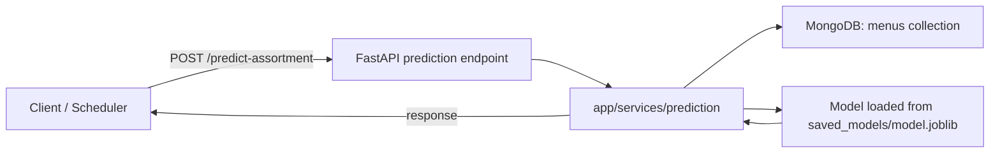
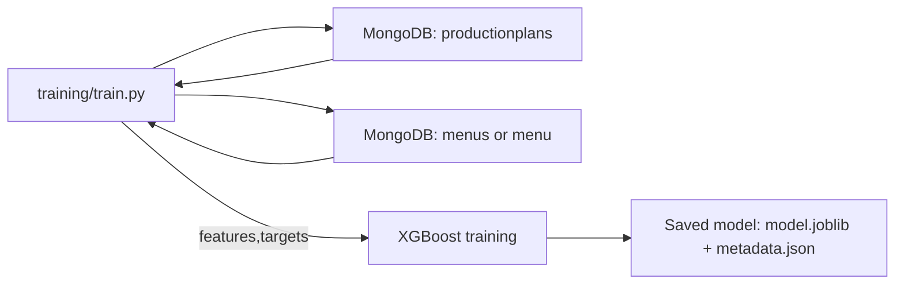

# 505-capstone-ml

A lightweight FastAPI microservice that provides demand-forecasting recommendations for newly created Production Plans. The service predicts per-menu recommended quantities using a saved regression model trained from historical `ProductionPlan` documents and related `Menu` data stored in MongoDB.

This repository contains both a training script and a serving API. The code is designed to integrate with the existing `505-capstone-backend` MongoDB schema used by the main application.

## Main goals
- Train a regression model (XGBoost) that predicts `soldQuantity` per menu item using historical ProductionPlan data.
- Expose a prediction endpoint (`/predict-assortment`) that returns a ranked list of recommended menu quantities for a new production plan.

## Technologies
- Python 3.9+ (tested with typical modern Python)
- FastAPI (API server)
- Uvicorn (ASGI server)
- PyMongo (MongoDB access)
- pandas (feature dataframe)
- scikit-learn / xgboost (training & model)
- joblib (model persistence)
- pydantic / pydantic-settings (config & request validation)

## Repository structure (important files)
- `app/main.py` — FastAPI application entrypoint and lifespan handling. ([app/main.py](app/main.py))
- `app/api/endpoints/prediction.py` — prediction API endpoint `/predict-assortment`. ([app/api/endpoints/prediction.py](app/api/endpoints/prediction.py))
- `app/api/router.py` — API router registration. ([app/api/router.py](app/api/router.py))
- `app/core/config.py` — configuration settings and path helpers. ([app/core/config.py](app/core/config.py))
- `app/db/mongodb.py` — MongoDB client helper (singleton). ([app/db/mongodb.py](app/db/mongodb.py))
- `app/schemas/prediction.py` — Pydantic request/response models. ([app/schemas/prediction.py](app/schemas/prediction.py))
- `app/services/prediction.py` — business logic: fetch menus, build features, call model, return top recommendations. ([app/services/prediction.py](app/services/prediction.py))
- `app/ml/features.py` — feature extraction & dataframe builder used at training + serving. ([app/ml/features.py](app/ml/features.py))
- `app/ml/model_loader.py` — Singleton model loader using `joblib`. ([app/ml/model_loader.py](app/ml/model_loader.py))
- `training/train.py` — training script that builds dataset from `productionplans` and `menus`, trains `xgboost.XGBRegressor`, and saves `saved_models/model.joblib`. ([training/train.py](training/train.py))
- `saved_models/metadata.json` — placeholder/metadata for the saved model. ([saved_models/metadata.json](saved_models/metadata.json))
- `requirements.txt` — runtime/serving dependencies. ([requirements.txt](requirements.txt))
- `requirements-train.txt` — training-time dependencies (includes `xgboost`). ([requirements-train.txt](requirements-train.txt))


## How the ML pipeline works

High level:

- Training: `training/train.py` queries the MongoDB `productionplans` collection for documents with `status` in `["completed","stopped"]`. For each plan it iterates `menus` items and extracts features (plan duration, start month, promo flag, menu selling price, ingredient count). The training target (`y`) is `soldQuantity` for each menu item in the plan. The script trains an `xgboost.XGBRegressor`, computes MAE on a test split, saves the trained model to `saved_models/model.joblib`, and writes basic `metadata.json`.

- Serving: The FastAPI endpoint receives a `PlanRequest` (duration, startDate, tags). The service fetches active menus from the MongoDB `menus` (or `menu`) collection, builds a features dataframe by combining the incoming plan fields with each menu's selling price and ingredient count (via `app/ml/features.py`), calls the loaded model to predict per-menu quantities, filters non-positive predictions, sorts by predicted quantity descending, and returns the top 10 `MenuRecommendation` items.

Mermaid: overall architecture



Mermaid: training data flow




## Data model & feature engineering (what's used)
- The code expects the backend `ProductionPlan` documents to include fields: `duration`, `startDate`, `tags`, and a `menus` array where each `menu` item contains `menuId`, `frozenSellingPrice` (optional), and `soldQuantity` (target). The training script queries `productionplans` collection (plural).
- Menu master data used from the `menus` (or `menu`) collection: `sellingPrice` and `ingredients` (array). `ingredient_count` is computed as `len(ingredients)`.
- Engineered features (in `app/ml/features.py` and used during training/serving):
  - `plan_duration` (float)
  - `start_month` (integer 1-12)
  - `is_promo` (binary, inferred from plan `tags` containing terms like `promo`, `promotion`, `discount`, `special`)
  - `menu_selling_price` (float; prefer `frozenSellingPrice` when available during training)
  - `ingredient_count` (int)


## API: endpoints and formats

POST /predict-assortment
- Request body (`application/json`): `PlanRequest` (see `app/schemas/prediction.py`)
  - `duration`: int
  - `startDate`: str (ISO datetime string, e.g. `2026-08-15T00:00:00Z`)
  - `tags`: list of strings

- Response: JSON array of `MenuRecommendation` objects (top recommendations sorted by predicted quantity desc):
  - `menuId`: string (Menu _id as string)
  - `name`: string (Menu name)
  - `recommendedQuantity`: integer (rounded predicted quantity)

Example request:

```bash
curl -X POST http://localhost:8000/predict-assortment \
  -H "Content-Type: application/json" \
  -d '{"duration":14,"startDate":"2026-08-15T00:00:00Z","tags":["promo"]}'
```

Example response (shape):

```json
[
  {"menuId": "60f7...", "name": "Nasi Goreng", "recommendedQuantity": 120},
  {"menuId": "60f8...", "name": "Mie Ayam", "recommendedQuantity": 95}
]
```


## How the service talks to the backend
- The service uses `pymongo` to connect directly to the MongoDB instance used by the backend. It reads the `menus` (or `menu`) collection at serving time and the `productionplans` collection at training time. Connection settings are managed via environment variables (see configuration below).


## Configuration and environment
Settings are defined in `app/core/config.py` and can be overridden using environment variables or a `.env` file. The code reads the following environment variables:

- `MONGODB_URI` — MongoDB connection string (default: `mongodb://localhost:27017`)
- `MONGODB_DB` — MongoDB database name (default: `kada`)

Other important paths (defaults in `app/core/config.py`):
- `saved_models/model.joblib` — default model path used by the singleton `ModelLoader`.
- `saved_models/metadata.json` — metadata produced by `training/train.py`.


## Installation & local run

1. Create a Python venv and activate it:

```bash
python -m venv .venv
# on Linux/macOS
source .venv/bin/activate
# on Windows (powershell)
.\.venv\Scripts\Activate.ps1
```

2. Install dependencies for serving (FastAPI API):

```bash
python -m pip install -r requirements.txt
```

3. Configure environment variables (example `.env` in repo root of `505-capstone-ml`):

```
MONGODB_URI=mongodb://localhost:27017
MONGODB_DB=kada
```

4. Start the API:

```bash
uvicorn app.main:app --reload --host 0.0.0.0 --port 8000
```


## Training (produce a model)

1. Install training dependencies (this includes `xgboost`):

```bash
python -m pip install -r requirements-train.txt
```

2. Ensure `MONGODB_URI` and `MONGODB_DB` point to the same database that contains the `productionplans` and `menus` collections.

3. Run the training script:

```bash
python training/train.py
```

On success the script writes `saved_models/model.joblib` and `saved_models/metadata.json`.


## Troubleshooting & limitations

- Model file missing: `app/ml/model_loader.py` raises a `FileNotFoundError` if `saved_models/model.joblib` is absent. Run the training script to generate a model or place a trained `model.joblib` at that path.
- MongoDB connectivity: the app uses `pymongo` with a short `serverSelectionTimeoutMS` timeout. Ensure your `MONGODB_URI` is reachable and credentials (if used) are correct.
- Collection names: the code expects `productionplans` (training) and `menus` or `menu` (serving & training). If your backend uses different collection names, update `app/services/prediction.py` and `training/train.py` accordingly.
- Feature set: the feature engineering is intentionally small and interpretable. For production-quality forecasting, consider adding temporal features, day-of-week, holidays, caching, ensembling, cross-validation, and per-menu historical trend features.


## Next steps & suggestions
- Add more historical/temporal features (daily sales, rolling averages) to `app/ml/features.py` and `training/train.py`.
- Add model versioning to `saved_models` (timestamped filenames) and update `app/core/config.py` to support a model registry.
- Add unit tests for `app/ml/features.py` and integration tests for `/predict-assortment`.


## Where to look in the code
- Prediction endpoint: [app/api/endpoints/prediction.py](app/api/endpoints/prediction.py)
- Feature engineering: [app/ml/features.py](app/ml/features.py)
- Training script: [training/train.py](training/train.py)
- Model loader: [app/ml/model_loader.py](app/ml/model_loader.py)
- DB client: [app/db/mongodb.py](app/db/mongodb.py)


---

If you want, I can (a) run the training script here (requires installing train deps), (b) start the API locally, or (c) add example unit tests and a minimal `README` usage script. Tell me which you'd like next.
